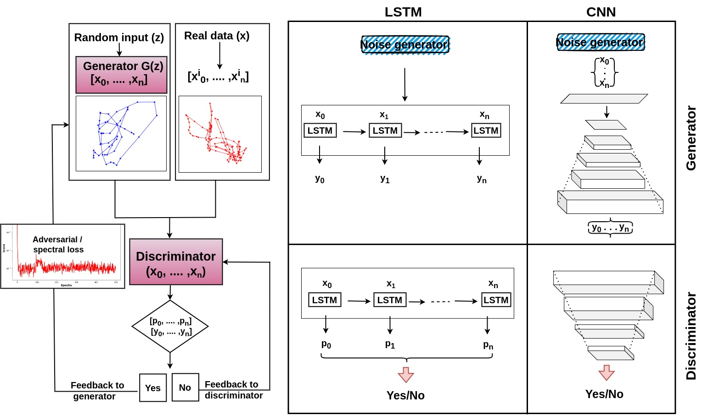
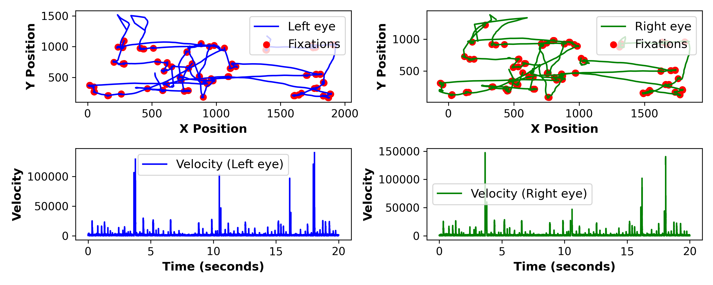

====================================
GAN: Time Series Generation Package
====================================

This package provides an implementation of Generative Adversarial Networks (GANs) for time series generation, with flexible architecture options. Users can select different combinations of generator and discriminator models, including Convolutional Neural Networks (CNN) and Long Short-Term Memory networks (LSTM), to suit their specific needs.

---

Table of Contents
==================

- `Features`_
- `Package Structure`_
- `Installation`_
- `Usage`_
  - `Command-Line Arguments`_
  - `Example Commands`_
- `Data Preparation`_
- `Model Architectures`_
- `Results`_
- `Dependencies`_
- `Contributing`_
- `License`_
- `Contact`_

---

Features
========

- **Flexible Model Selection**: Choose between CNN and LSTM architectures for both the generator and discriminator.
- **Time Series Generation**: Generate synthetic time series data based on input sequences.
- **Customizable Parameters**: Adjust hyperparameters such as epochs, batch size, and latent dimension.
- **Data Preprocessing**: Includes utilities for loading and preprocessing time series data.
- **Evaluation Metrics**: Calculate and visualize performance metrics like loss and JS divergence.
- **Modular Codebase**: Organized code structure for ease of maintenance and extension.

---

Package Structure
=================

.. code-block:: bash

   GANsForVirtualEye/
   ├── gan_package/
   ├── docs/
   │   ├── __init__.py
   │   ├── dataloader.py
   │   ├── models.py
   │   ├── train.py
   │   ├── testing.py
   │   ├── utils.py
   ├── main.py
   ├── setup.py
   ├── requirements.txt
   ├── README.md

---

Installation
============

Prerequisites
-------------

- Python 3.6 or higher
- `pip` package manager

Steps
-----

1. **Clone the Repository**

   .. code-block:: bash

      git clone https://github.com/shailendrabhandari/GANsForVirtualEye.git 
      cd GANsForVirtualEye

2. **Install Required Packages**

   It's recommended to use a virtual environment.

   .. code-block:: bash

      pip install -r requirements.txt

3. **Install the Package**

   .. code-block:: bash

      pip install .

---

Usage
=====

The package can be used by running the `main.py` script, which facilates the data loading, model training, and evaluation processes.

Command-Line Arguments
----------------------

- `--data_path`: Path to your data folder containing the `.txt` files.
- `--save_path`: Path where results and models will be saved.
- `--epochs`: Number of training epochs (default: 500).
- `--batch_size`: Batch size for training (default: 128).
- `--latent_dim`: Dimension of the latent space for the generator (default: 256).
- `--generator_model`: Generator model to use (`CNNGenerator2` or `LSTMGenerator`).
- `--discriminator_model`: Discriminator model to use (`CNNDiscriminator2` or `LSTMDiscriminator`).

Example Commands
----------------

1. CNN Generator with CNN Discriminator

   .. code-block:: bash

      python main.py --data_path '/path/to/your/data' --save_path './results' \
      --generator_model 'CNNGenerator' --discriminator_model 'CNNDiscriminator'

2. LSTM Generator with LSTM Discriminator

   .. code-block:: bash

      python main.py --data_path '/path/to/your/data' --save_path './results' \
      --generator_model 'LSTMGenerator' --discriminator_model 'LSTMDiscriminator'

---

Data Preparation
================

This package explicitly expects time series data in the form of `.txt` files, each containing sequences of velocity measurements or similar metrics.

Data Format
-----------

Each `.txt` file should contain columns representing:
- Time stamps
- X and Y positions for left and right eye
- Additional metrics like saccade indicators

Data Loading
------------

The `dataloader.py` module handles data loading and preprocessing:

- **Data Cleaning**: Removes the first `n` data points and handles NaN values.
- **Feature Engineering**: Calculates velocities and filters out non-positive values.
- **Normalization**: Normalizes the data using `MinMaxScaler`.
- **Sequence Sampling**: Samples sequences of a specified length for training.

---

Model Architectures
===================

Generators
----------

1. **CNNGenerator**

   - **Input**: Latent vector of shape `(batch_size, latent_dim, 1)`
   - **Output**: Generated sequence of shape `(batch_size, 1, sequence_length)`

2. **LSTMGenerator**

   - **Input**: Latent vector of shape `(batch_size, sequence_length, latent_dim)`
   - **Output**: Generated sequence of shape `(batch_size, sequence_length, output_channels)`

Discriminators
--------------

1. **CNNDiscriminator**

   - **Input**: Sequence of shape `(batch_size, 1, sequence_length)`
   - **Output**: Probability score indicating real or fake

2. **LSTMDiscriminator**

   - **Input**: Sequence of shape `(batch_size, sequence_length, input_size)`
   - **Output**: Probability score indicating real or fake

---

Results
=======

After training, results and models are saved to the specified `--save_path` directory.

- **Model Checkpoints**: Saved as `generator.pt` and `discriminator.pt`.
- **Training Metrics**: Spectral Loss values and divergence scores saved as `.npy` files.
- **Evaluation Plot**: A histogram comparing real and generated data distributions saved as `RealVSGenerated_velGAN.pdf`.

Dependencies
============

- Python 3.6 or higher
- `numpy`, `torch`, `torchvision`, `matplotlib`, `scipy`, `sklearn`, `pandas`, `progressbar2`

.. code-block:: bash

   pip install -r requirements.txt

---

License
=======

This project is licensed under the MIT License.

---

Contact
=======

- **Shailendra Bhandari**
- **Email**: shailendra.bhandari@oslomet.no
- **GitHub**: https://github.com/shailendrabhandari

---

Citation
========

If you use this package in your research or projects, please cite it as:

.. code-block:: bibtex

    @misc{bhandari2024modelingeyegazevelocity,
          title={Modeling Eye Gaze Velocity Trajectories using GANs with Spectral Loss for Enhanced Fidelity}, 
          author={Shailendra Bhandari and Pedro Lencastre and Rujeena Mathema and Alexander Szorkovszky and Anis Yazidi and Pedro Lind},
          year={2024},
          eprint={2412.04184},
          archivePrefix={arXiv},
          primaryClass={cs.NE},
          url={https://arxiv.org/abs/2412.04184}, 
    }

---

Acknowledgment
==============

Thank You for Using GAN Time Series Generation Package!
=======================================================

We hope this package helps you in your research or projects involving time series data generation.